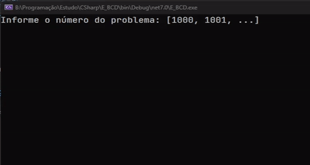

<h1 align="center"> Organizador de Download </h1>

Esse repositório contem todas as minhas soluções dos exercícios do Beecrowd em C#

  <a href="#%EF%B8%8F-projeto">Projeto</a>&nbsp;&nbsp;&nbsp;|&nbsp;&nbsp;&nbsp;
  <a href="#%EF%B8%8F-perfil">Perfil</a>&nbsp;&nbsp;&nbsp;|&nbsp;&nbsp;&nbsp;
  <a href="#%EF%B8%8F-tecnologias">Tecnologias</a>&nbsp;&nbsp;&nbsp;|&nbsp;&nbsp;&nbsp;
  <a href="#%EF%B8%8F-demo">Demo</a>&nbsp;&nbsp;&nbsp;

## 💻 Projeto

Esse projeto foi criado com o objetivo de exercitar minha lógica de programação. E criar memória "muscular" com a linguagem em questão.

## 👤 Perfil

Você pode acessar o meu perfil do beecrowd **[aqui](https://www.beecrowd.com.br/judge/pt/profile/770797)**

## 🏗️ Tecnologias

Esse projeto foi desenvolvido com as seguintes tecnologias:

- C#;
- .NET 7.0;

## ⚙️ DEMO

